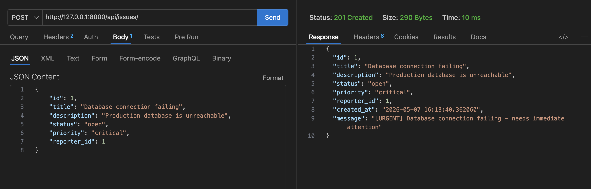

# DevTrack - Engineering Issue Tracker

DevTrack is a minimal Django-based backend for tracking engineering bugs, priorities, and statuses.

## How to Run
1. Navigate to the project folder: `cd devtrack`
2. Activate the virtual environment: `source ../venv/bin/activate`
3. Run the server: `python manage.py runserver`

## Endpoints
- `POST /api/reporters/`: Create a new reporter (JSON body required).
- `GET /api/reporters/`: Get all reporters.
- `GET /api/reporters/?id=1`: Get a single reporter by ID.
- `POST /api/issues/`: Create a new issue (subclasses based on priority).
- `GET /api/issues/`: Get all issues.
- `GET /api/issues/?status=open`: Filter issues by status.
- `GET /api/issues/?id=1`: Get a single issue by ID (Returns 404 if not found).

## Design Decision
For the `describe()` method, I chose to use **Polymorphism**. I created a base `Issue` class with a default description and two subclasses: `CriticalIssue` and `LowPriorityIssue`. 

**Why:** This follows the Open/Closed Principle. If the engineering team wants a new description style for "Medium" priority later, we can simply add a new subclass without changing the logic in the views or the base class.

## Screenshots

### 1. Success Case: Creating a Critical Issue (201 Created)
This screenshot shows the OOP inheritance logic working. Notice the "[URGENT]" message generated by the `CriticalIssue` subclass.

### 2. Failure Case: Validation Error (400 Bad Request)
This screenshot shows the `validate()` method catching an empty title.

### 3. Failure Case: Resource Not Found (404 Not Found)
This screenshot shows the API returning a 404 when looking up an ID that does not exist.

